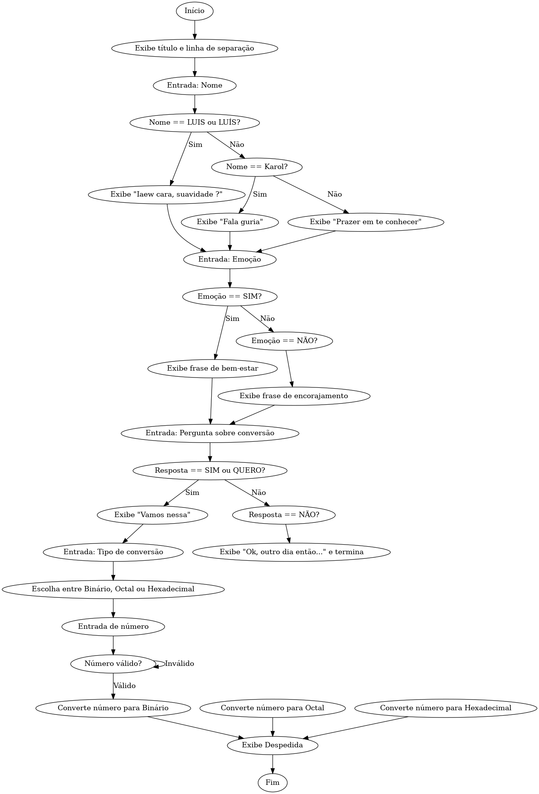

# Conversor de bases númericas 
Esse projeto foi feito para ajudar quem tem dificuldade em converter números entre as bases decimal, binária, octal e hexadecimal. A ideia é tornar esse processo mais fácil e intuitivo para quem está aprendendo.

###**Sobre Mim:**

Sou uma pessoa que gosta de prestar atenção nos detalhes e, às vezes, acabo me preocupando mais com a forma do que com o significado. Para deixar o projeto mais interessante, criei um robô chamado ASCE, que interage com o usuário. Antes de apresentar o projeto, ASCE bate um papo com o usuário de um jeito descontraído, como se fosse uma criança curiosa, tentando entender o mundo ao seu redor.

###**Desafios e Aprendizados:**

Enquanto desenvolvia o projeto, aprendi bastante sobre conversão de bases numéricas. O maior desafio foi com o uso da estrutura while, que era algo novo para mim. Mas, depois de algumas tentativas, acho que já peguei o jeito.

O algoritmo em si eu consegui desenvolver de maneira rápida, mas o que realmente me tomou mais tempo foi entender como implementar a estrutura while corretamente e toda a parte de interação "humanizada" com o usuário, que exigiu um toque mais cuidadoso para criar uma conversa envolvente e divertida.

###**O Que Vem Por Aí:**

No futuro, quero adicionar um loop de repetição nos meus projetos, para que o programa não feche logo após ser usado. Assim, o usuário pode utilizar várias vezes, fechando o programa só quando realmente quiser.

###**Observações Importantes:**

Vale destacar que o programa ainda não possui uma interface gráfica (front-end). Ou seja, ele só roda no terminal. Para dar início ao uso, o usuário deve chamar o ASCE, como se estivesse começando uma conversa em um chat, como no WhatsApp, por exemplo.

## **Tabela de conteúdos**

•[Arquitetura](##Arquitetura)

•[Features](##Features)

•[Instruções de uso](##Instruções-de-uso)

•[Contribua com o projeto](##Contribua-com-o-projeto)

•[Extra](##Extra)

##**Arquitetura**



---

### **1. Bibliotecas Usadas**

```python
import time
import random
```

- **`import time`**: A biblioteca `time` é usada para manipulação de tempo no Python. Aqui, ela é usada para adicionar atrasos no programa (com a função `time.sleep()`) e simular uma sensação de interação mais realista com o usuário, como esperar um pouco antes de mostrar as próximas mensagens.
  
- **`import random`**: A biblioteca `random` permite gerar números aleatórios. No código, ela é usada para escolher aleatoriamente uma frase de uma lista de opções (para as respostas sobre o estado emocional do usuário).

---

### **2. Estética e Formatação do Texto**

```python
print('{:=^40}'.format('Desafio 37'))
print('{:80}'.format(40 * '='))
```

- **`print`**: A função `print()` serve para exibir informações no terminal ou console. 
- **`'{:=^40}'.format('Desafio 37')`**: Este comando formata o texto `'Desafio 37'` para exibi-lo centralizado, com um total de 40 caracteres. O `=` é utilizado para preencher os espaços à esquerda e à direita, criando uma borda ao redor do título.
  
- **`'{:80}'.format(40 * '=')`**: Este comando imprime uma linha de 80 caracteres preenchida com o símbolo `=`. Ele é usado para criar uma linha de separação visual no terminal.

---

### **3. Interação com o Usuário - Entrada de Nome**

```python
nome = input('Olaaaa!!!!! Eu me camo ASCE, como é seu nome ?  ').strip().upper()
```

- **`input()`**: A função `input()` solicita uma entrada do usuário. O que for digitado pelo usuário será armazenado na variável `nome`.
  
- **`strip()`**: O método `strip()` remove espaços em branco extras no início e no final da string.
  
- **`upper()`**: O método `upper()` converte toda a string para letras maiúsculas. Isso é feito para garantir que a comparação com as opções de nome seja feita de maneira case-insensitive (independente de letras maiúsculas ou minúsculas).

---

### **4. Condições e Comparações de Nome**

```python
if nome == 'LUIS' or 'LUÍS':
    print('Iaew cara, suavidade ?')
elif nome == 'Karol':
    print('Fala guria')
else:
    print('É um prazer em te conhecer!!!!')
```

- **`if` / `elif` / `else`**: Estas são instruções condicionais que controlam o fluxo do programa. O código executa o bloco correspondente à primeira condição que for verdadeira.
  
- **`nome == 'LUIS' or 'LUÍS'`**: Esta condição está tentando comparar o valor de `nome` com `'LUIS'` ou `'LUÍS'`. Porém, ela não está funcionando corretamente. A expressão `'or 'LUÍS'` sempre será verdadeira, independentemente do nome fornecido. O correto seria usar `nome == 'LUIS' or nome == 'LUÍS'`.

- **`print()`**: A função `print()` exibe as mensagens de acordo com o nome do usuário.

---

### **5. Pergunta sobre Emoção**

```python
emoção = input('Você está bem? ').strip().upper()
```

- **`emoção = input()`**: A função `input()` solicita que o usuário informe se está bem ou não.
  
- **`strip()` e `upper()`**: Assim como na entrada do nome, essas funções garantem que a entrada do usuário seja tratada, removendo espaços extras e convertendo para maiúsculas.

---

### **6. Validação da Resposta de Emoção**

```python
while emoção not in ['SIM', 'NÃO']:
    emoção = input('Eu sou meio binário, vai ter que escolher entre SIM e NÃO :D : ').strip().upper()
```

- **`while`**: O loop `while` continuará executando o código dentro dele até que a condição seja falsa. Neste caso, ele pede ao usuário para digitar novamente caso a resposta não seja "SIM" ou "NÃO".

---

### **7. Resposta Condicional sobre Emoção**

```python
if emoção == 'SIM':
    frase = print(random.choice(estoubem))
else:
    frase = print(random.choice(estoumal))
```

- **`if` / `else`**: O programa escolhe qual lista de frases usar com base na emoção do usuário.
  
- **`random.choice(estoubem)` e `random.choice(estoumal)`**: A função `random.choice()` seleciona aleatoriamente um item de uma lista. Se o usuário estiver bem, uma frase da lista `estoubem` será escolhida; caso contrário, uma frase de `estoumal` será escolhida.

---

### **8. Pergunta sobre Conversão de Números**

```python
pergunta = input('Aprendi uma nova utilidade... Quer ver ?: ').strip().upper()
```

- A função `input()` pergunta ao usuário se ele quer ver uma nova funcionalidade do programa, com a resposta sendo validada com `strip()` e `upper()`.

---

### **9. Conversão de Números**

```python
es = input('[1] Converter para BINÁRIO\n[2] Converter para OCTAL\n[3] Converter para HEXADECIMAL\n\n')
```

- **`input()`**: A função `input()` exibe uma lista de opções para o usuário escolher o tipo de conversão desejada.

---

### **10. Loop para Entrada de Número**

```python
while True:
    try:
        nu = int(input('Digite um número inteiro : '))
        break
    except ValueError:
        print('Isso não parece uma opção válida, tente novamente!')
```

- **`while True`**: Um loop infinito que só é interrompido quando a conversão para inteiro é bem-sucedida. Se o usuário digitar algo que não pode ser convertido em número (como letras), o bloco `except` captura o erro (`ValueError`) e exibe uma mensagem de erro.

---

### **11. Conversão de Base Numérica**

```python
if '1':
    print('O numéro {} convertido para binário é {}'.format(nu,bin(nu).lstrip('0ob')))
elif '2':
    print('O número {} convertido para octal é {}'.format(nu,oct(nu).lstrip('0ob')))
else:
    print('O número {} convertido para hexadecimal é {}'.format(nu,hex(nu).lstrip('0ob')))
```

- **`if '1'`**: Aqui, a condição não está correta. Para verificar se o usuário escolheu a opção 1, a comparação deveria ser com `es == '1'`, e não apenas com a string `'1'`.
  
- **`bin(nu)`**: Converte um número para sua representação binária.
- **`oct(nu)`**: Converte um número para sua representação octal.
- **`hex(nu)`**: Converte um número para sua representação hexadecimal.
  
- **`lstrip('0ob')`**: Remove os prefixos `'0b'` (para binário), `'0o'` (para octal) e `'0x'` (para hexadecimal) das representações, para que os números apareçam de forma limpa.

---

### **12. Despedida**

```python
print('Espero ter sido util a você {}, até a próxima :D'.format(nome))
```

- **`print()`**: A função `print()` exibe uma mensagem de despedida, substituindo `{}` pelo nome do usuário, graças ao método `format()`.

---

### **Considerações Finais:**
O código é interativo e permite que o usuário forneça entradas que influenciam a execução do programa. Ele usa condições para decidir o fluxo de execução e lida com entradas de forma robusta (com tratamento de erros). O uso das bibliotecas `time` e `random` adiciona uma sensação de interação dinâmica e aleatória.

##**Features**##

Basicamente meu código muda a base numérica de acordo com a vontade do usuário.

##**Contribua com o projeto**

Ele está disponível para versionamento, e caso você tenha alguma idéia legal, ou tenha criado uma versão melhor entre em [contato](https://meu-site-livid-two.vercel.app/), para assim eu divulgar sua versão com o seus créditos.

##**Extra**##

Eu espero ter te ajudado de alguma forma, tenha um bom dia, ou tarde, ou noite ou madrugada (prefiro codar de madrugada). 


